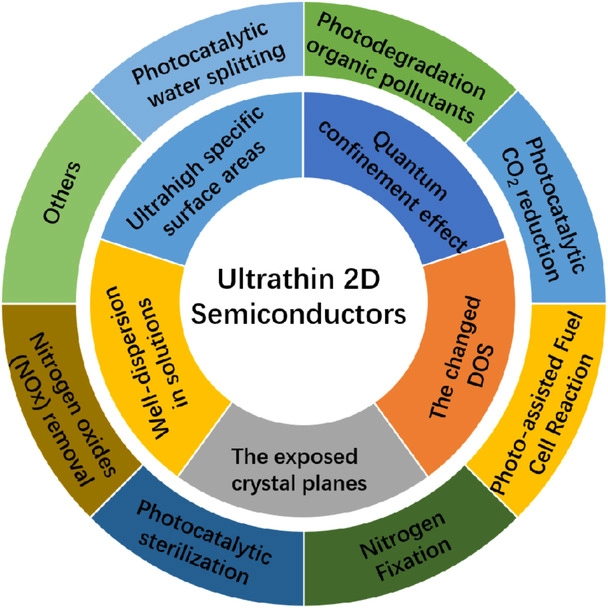

# PHOTOCATALTSYT-I

Here we are working on 2D materials reducing CO2 to hydrocarbon

## Separation of CO2 at 2D graphene-based materials

## Calculations

### pristine graphene adsorptions

- We need to compare total energy of adsorbed CO2+graphene and CO2+graphene system with no bond -!!!  same K point and same E_cut

  for adsorbed system E ~ -300.71153762 (kpoints )   -------  no adsorption -300.94   (0.24 Ry ~ 3.26 eV more stable )

  

### Graphene-defect + CO2

## To-do list

- [x] make a graphene models and check its geometry
- [ ] spin polarization of graphene and its electronic structure
- [ ] spin polarization after adsorption of CO2
- [ ] Spin polarization of the graphene before and after adsorption of CO2
- [ ] Difference between Total energy of the systems with same number of atoms and same input setting (k-points, nbnd, Ecut, smearing, occupation, ....)

## Discussions
- For pristine graphene adsorption occurs in top site and for defected graphene adsorption occurs in top and hole sites.
- In the case of pristine graphene by comaparing total energy of adsorbed CO2+graphene and unadsorbed CO2+graphene it is clear that unadsorbed system is more stable than adsorbed one. However in the case of defected graphene adsorbed system is more stable than unadsorbed one.
- Defected graphene has negative fermi energy which is can be related to its metal property. Also its band structure file shows conduction band is correlated with the valance band.

 

## References

https://onlinelibrary.wiley.com/doi/full/10.1002/cey2.41   (mechanisms)

